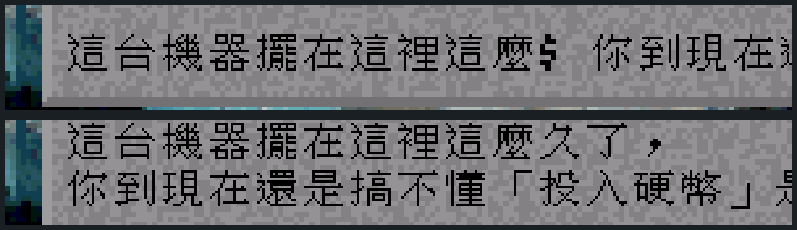
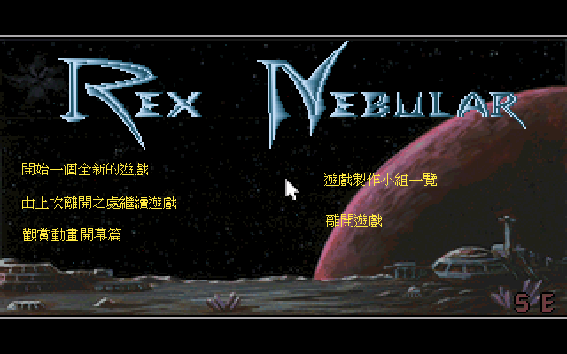
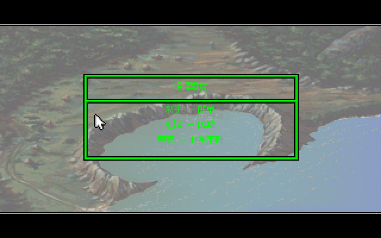
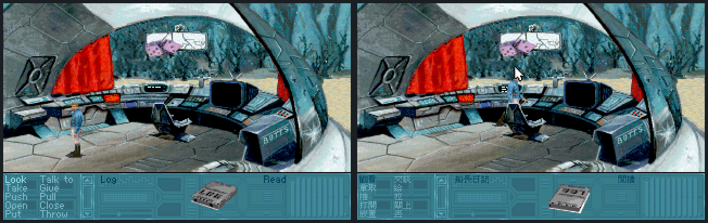
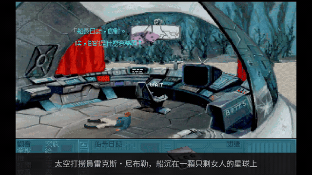
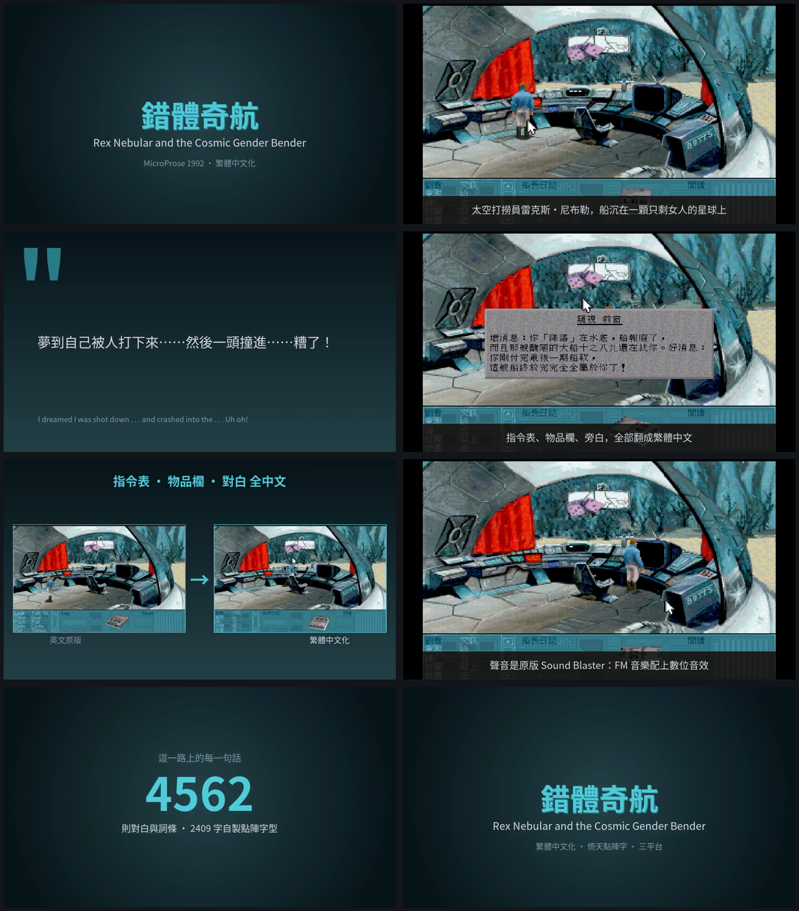

# 錯體奇航 — 撿花瓶撿到變性的太空意外　繁體中文化

*Rex Nebular and the Cosmic Gender Bender*

有人要從一顆沒去過的星球取回一只花瓶。這差事得有經驗、有本事，還要蠢到肯接，全銀河系只有一個——雷克斯‧尼布勒，星際探險家兼光棍。他開著「油豬號」上路，沒問那花瓶憑什麼值錢。

進大氣層時防禦砲火開了。船沉進海裡，他在駕駛艙地板上醒來，家當只剩一本船長日誌。而這顆星球很久沒有男人踏上來過——居民為此想出了一套辦法。

這條路上 **4,562 則對白與詞條** 全翻了，配 2,409 字自製點陣字型，照原作調性重寫成台灣人會笑的講法。

本專案不含遊戲本體，只有碼表、譯文、字型與工具。玩法見〈怎麼玩〉。


---

## 這款當年沒有中文版，只有中文說明書

台灣的老遊戲清單裡查不到這款的中文版；但我們手上有一本 20 個版面的中文遊戲手冊，
把操作介面、選項、道具全都譯過一輪。也就是說：**當年有人把說明書翻完了，遊戲本身卻始終是英文的。**

那本手冊的文案寫得比遊戲本身還放。第一頁是這樣介紹主角的：

> 全星系中就只有一個人夠經驗、夠本事，也夠愚蠢地去接受這項任務！他就是星際探險家兼光棍王老五——雷克斯‧尼布勒。歡迎加入雷克斯和他最心愛的座船「油豬號」，咱們一起墜落到「泰拉‧安卓姬娜」行星吧！這是一個住滿詭異外星女人的星球，她們正從事著一項驚人大計劃。

「夠經驗、夠本事，也夠愚蠢」這種三段式，還有把 bachelor 譯成「光棍王老五」——
1990 年代台灣代理商的文案語感，現在讀起來反而比直譯有味道。
這份中文化的語氣就是照著這個基準抓的。

譯名也全部接了回去，包括那艘船的名字。

| 英文 | 中文 | 出處 |
|---|---|---|
| Rex Nebular | 雷克斯‧尼布勒 | 手冊 |
| *Slippery Pig* / the Pig | **油豬號** | 手冊（300dpi 複核）＋遊戲文字交叉印證 |
| Log | 船長日誌 | 手冊 |
| Rebreather | 水中呼吸器 | 手冊 |
| Terra Androgena | **泰拉‧安卓姬娜** | 手冊 |
| Cosmic Gender Bender | **性別轉換機** | 手冊 |
| Story Line: Naughty / Nice | **限制級 / 輔導級** | 手冊 |
| No Sound | **無聲勝有聲** | 手冊（當年的譯法，原樣保留） |
| Sound Blaster | 聲霸卡 | 手冊（當年的硬體譯名） |

船名這條走了一段彎路：第一次用 110dpi 判讀成「油鵝號」，後來從遊戲文字裡撈到
`the "Slippery Pig"`，回頭用 300dpi 重掃，才確認手冊寫的是**油豬號**。
一手資料永遠贏推論——這個專案裡不只發生一次。

完整譯名表見 [`docs/20-glossary.md`](docs/20-glossary.md)。

## 技術：MADS 引擎沒有中文路徑，所以得動引擎

這款跑在 ScummVM 的 **MADS** 引擎上（gameid `nebular`），不是 SCUMM。
差別很要命：SCUMM 有現成的 CJK 路徑，挑對碼空間就能零改動；MADS 沒有。

```cpp
// engines/mads/font.cpp  Font::writeString()
char theChar = (*text++) & 0x7F;      // ← 每個位元組被強制遮成 7-bit
```

`_charWidths` 只開 128 格。任何 ≥ 0x80 的位元組——Big5 的 lead byte 必然是——都會被折成一個
ASCII 字元。這一行決定了整個專案的形狀：**非改引擎不可**，剩下的問題只是「怎麼改得夠小」。

改動集中在七個地方，每個都說得出為什麼非改不可：

| 檔案 | 改什麼 | 為什麼 |
|---|---|---|
| `mads/cht.h/.cpp`（新增） | Big5 點陣字庫 + 譯文替換表 | 中文邏輯全部關在這裡 |
| `font.cpp` | 認雙位元組、中文畫進文字層、寬度回報等效值 | 上面那行 `& 0x7F` |
| `screen.cpp` | 2× nearest 放大 + 文字層合成 | 讓中文以原生解析度顯示 |
| `game.cpp` / `scene.cpp` / `menu_views.cpp` / `staticres.cpp` | 前五個文字來源的查表 hook | 少接一個就露英文 |
| `animation.cpp` | 第六個文字來源（`*.AA` 動畫內嵌訊息）的查表 hook | 見下面「第六個來源」 |
| `dialogs_nebular.cpp` / `action.cpp` / `user_interface.cpp` | Big5 安全的大小寫、結尾判斷與控制碼括號解析 | 見下面「許功蓋問題」 |
| `nebular/menu_nebular.cpp/.h` | 主選單的中文標籤疊繪 | 選項是 bitmap 美術不是文字，見下面「主選單是圖不是字」 |

### 中文為什麼要另開一層畫

第一版把 16×15 的中文畫進遊戲的 320×200 緩衝，結果被 `Screen::update()` 連同底圖
一起放大成 **32×30 實際像素**——比放大後的英文（14px）大了一倍有餘。

放大這件事發生在「送畫面」那層，它不分辨像素是底圖還是文字。但**底圖需要放大**
（原生 pixel art），**文字不需要**（點陣字是為某個尺寸手工調的）。綁在同一次放大裡，
必定有一方是錯的。

解法是開一張 640×400 的文字層，中文 1:1 畫上去、不跟著放大，合成時疊在放大後的底圖上；
排版度量則回報「320 空間的等效寬度」。這一步做完之後，**先前為了塞中文而改的 UI 佈局全部撤回了**
——原版的 5 列 8px 指令表重新變得剛好。改對架構，引擎改動反而變少。

### 三個查了很久的坑

這三個的共同點：**都不會崩潰、不會報錯**，畫面看起來只是「怪怪的」。

**顏色 0 不能當透明。** 文字層用「像素值 0」判斷透明，但 0 是合法的調色盤索引，
而 MADS 的文字色真的會是 0。那些字被畫成 0、合成時判定成透明，於是**一行字裡少了幾個**，
露出底圖，看起來像被黑塊蓋住。解法是另開遮罩。
通則：任何「用特殊值代表沒有資料」的設計，先問這個值是不是也是合法資料。

**「許功蓋問題」有四型，我一次只想到一型。** 這是整個專案裡最花時間的一條線。

Big5 的第二個位元組（trail byte）落在 ASCII 可見字元範圍是常態。任何**逐 byte** 處理
中文字串的地方，都會在那個位元組上出事——而且症狀一律是「某幾個字悄悄變成別的字」，
不崩潰、不報錯，很容易誤判成字型缺字而查錯方向。

第一型我一開始就處理了：`menu_views.cpp` 用 `strchr(line, '@')` 找置中標記，`@` 是 **0x40**，
而「作」= `A7 40`、「一」= `A4 40`。片尾因此顯示成「製宏P設計」（應為「製作與設計」）。

**真正嚴重的是第三型，而我的盤點指令根本掃不到它。** `Common::String::toUppercase()` /
`toLowercase()` 也是逐 byte——跑 `toupper`/`tolower` 對 trail byte 加減 0x20：

```
「遊戲」  → toLowercase → 「鉍戲」
「關上」  → toLowercase → 「關已」
「通風口」→ toUppercase → 「被風了」
```

實測 **4,357 筆譯文有 3,619 筆（83%）中招**（這一節的分母是當時的譯文筆數，
後來補進 `*.AA` 的 199 則與主選單 6 則才成為 4,562）。觸發點是 `DialogsNebular::getVocab()`——
`_capitalizationMode` 預設就是 `kUppercase`，所以任何含 `[VERB]`/`[NOUN]` 佔位符的對話框
都會走到。（第二型是 `hasSuffix("s")` 判英文複數，中文譯文尾位元組可能剛好是 `'s'`。）

會漏掉是因為我自己寫的盤點指令犯了兩個錯：**只掃 `strchr` 那一類**（沒把大小寫轉換
算成「逐 byte 操作」），而且**只掃頂層目錄**——最嚴重的那處剛好在 `nebular/` 子目錄下。

修法是逐**字元**走而非逐 byte，雙位元組整個跳過（中文沒有大小寫），ASCII 照常轉換。
驗證拿全量譯文對照：修正後 8,714 次轉換中文 byte 全不變、ASCII 仍正確轉換
（`[title26]` → `[TITLE26]` 佔位符功能沒壞）；同一批餵給原本的逐 byte 版，**6,154 次會改壞**。

**然後第四型又冒出來，而且是靠一張截圖發現的。** 對話框的譯文帶控制碼
（`[title32][sentence]`、`[noun1]`），`DialogsNebular::show()` 逐 byte 找 `[` 和 `]`
判斷指令邊界。「也」= `A4 5D`、「（」= `A1 5D`、「久」= `A4 5B`——trail byte 剛好就是括號。

```
譯文   這台機器擺在這裡這麼久了，\n你到現在還是搞不懂「投入硬幣」是什麼意思。
畫面   這台機器擺在這裡這麼⁋　你到現在還是搞不懂「投入硬幣」是什麼意思。
                            ↑「久了，」三個字沒了，只剩一個怪符號
```



上下是同一句話、同一個位置，只差引擎版本。上面那行「這麼」後面本來該是「久了，」，
畫面上卻只剩一個半形怪符號——而且因為 `\n` 也一起被吞進指令模式，下一行被擠掉了。

`]` 那型比 `[` 更難查：它落在 `else if (*srcP == ']')` 分支，指令旗標為 false 時
**什麼事都不做**——那個 byte 就這樣消失，畫面上只剩一個落單的 lead byte 畫成的半形怪符號。
而且迴圈每處理完一行就重置旗標，所以**只有含受害字的那一行壞掉，同一個對話框的其他行完全正常**，
看起來更像「翻譯打錯字」。實測影響 **460 / 4,357 行（10.6%）**，而「也」「（」都是高頻字。

四次都是同一個模式：**看到畫面壞掉，才回頭找哪裡逐 byte 了。** 問題是要先想到該 grep 什麼字元，
而「`]` 也是 trail byte」這件事不會自己浮現。所以最後改成讓工具去交叉比對
（[`tools/big5_hazard_scan.py`](workplace/tools/big5_hazard_scan.py)）：一邊掃引擎原始碼抓出
所有「拿單一字元跟某個 byte 比對」的位置，只留下字元值落在 Big5 trail byte 範圍（0x40–0x7E）的；
另一邊掃譯文算出每個危險字元**實際**會撞到哪些字、幾行。兩邊交叉，未防護且譯文真的會撞就 exit 1。

它跑出來的其中一行很適合當這個 bug 的註腳：

```
'\' (0x5C)  實際命中：譯文 171 行、9 個字　例：擺×47 許×38 蓋×30 餐×26 功×19 髏×6
```

許、功、蓋三個字都在裡面——這個 bug 的名字就是這麼來的。

確定某個位置不是譯文路徑（資源檔名、腳本指令行、debug console 輸入都是純 ASCII），
就寫進 `big5_hazard_allowlist.tsv` **並附理由**，而不是調參數讓它閉嘴。
掃描器自己也做過正對照：把 `dialogs_nebular.cpp` 的防護整段拆掉，確認它會叫。
第一版沒過——判定「已防護」的關鍵字收了 `cht`，而同一個函式裡 `const bool chtOn = ...`
這行還在偵測窗內，於是防護拆光了它照樣說沒問題。

**翻譯會靜默改變引擎行為。** `action.cpp` 有一處拿 vocab 字串去**比對**而不是顯示
（`getVocab(...) != kFenceStr`）。把 vocab 翻成中文後，這個比對永遠成立，遊戲邏輯就變了——
不會報錯，也不會崩潰。解法是留一份未翻譯的原文供比對：**顯示用譯文，邏輯用原文**。

### 第六個來源：整包漏掉的 199 則

追第四型的過程裡，有一張截圖上出現一個看不懂的白色英文字浮在太空船控制台上方。
查到最後那個字是原作的 sprite 美術（跟中文化無關），但沿途翻遍所有文字來源時，
發現 `*.AA` 動畫檔裡**也有字**——而抽字工具從頭到尾只認五個來源，這個沒進去過。

MADS 的動畫檔 chunk 1 是一個訊息陣列，每筆固定 96 bytes：音效編號 + 64 bytes 字串
+ 位置 + 兩組 RGB + 起訖幀（`animation.cpp:74`）。203 個動畫檔裡有 50 個帶訊息，共 **199 則**。
內容不是無關緊要的裝飾：逮捕、搜身、手術檯、片頭太空戰，全是主線必經的過場對白。

代價最直觀的是這個——**Rox、Karg、Xina、Gyrain、Twinkles、Rhotunda、Olga、Boog、Og
這九個角色的名字只出現在這裡**，其他五個來源逐一 grep 全部零命中。也就是說在補抽之前，
這批名字從未進過翻譯流程，而任何「譯名表已經完整」的判斷都是錯的。

補完之後回頭看，這件事的教訓不在「MADS 的動畫檔有內嵌文字」這條知識，
而在**「抽字工具跑完沒報錯」證明不了完整性**。要證明完整，得反過來問：
畫面上每一個看得到的字，我能不能說出它從哪個來源來。

順帶一提，這也讓驗收方式多了一項：遊玩錄影走的是「開始新遊戲」，
整段跳過開場動畫——那 199 則就算全露英文，遊玩錄影也一張都照不到。
所以另外寫了 [`shot_intro.sh`](workplace/tools/shot_intro.sh) 專門截開場動畫。

技術細節見 [`docs/30-engine-design.md`](docs/30-engine-design.md)，
文字來源的完整清單與則數見 [`docs/00-scope.md`](docs/00-scope.md)。

## 主選單是圖不是字

```cpp
// font.h:36
FONT_MENU "*FONTMENU.FF"  // Not in Rex (uses bitmap files for menu strings)
```

這行註解是原作者留的。主選單的每一個選項都是一張 sprite（`RM990A1.SS`～`RM990A7.SS`，
各 14 幀，用來做逐項淡入），換字型換不到它——中文化等於改圖。

走的是「不動原美術」那條路：原本的淡入動畫照跑，跑完之後把英文 sprite 收掉，
在中文文字層的同一組座標畫上譯名。選項的點擊範圍是 `display()` 註冊在 `screenObjects`
的，跟 sprite 在不在無關，所以收掉之後照樣點得動。



譯名全部照當年的中文手冊——「開始一個全新的遊戲」「由上次離開之處繼續遊戲」
「觀賞動畫開幕篇」。這些在原本的英文 bitmap 上只是 `Start a new game`，
手冊卻譯成整句，而 1 倍字級剛好塞得下，就照手冊走。

**字色不是挑的，是從原圖數出來的。** 主選單會 `resetGamePalette()` 換調色盤，
自己選一個索引等於賭它在那張盤裡剛好是黃的。改成統計原 sprite 用得最多的非透明色，
五個選項一致回報 index 236。

> [雷] 收 sprite 用的 `SpriteSlots::reset()` 預設參數是 `reset(true)`，那會連
> `_scene._sprites.clear()` 一起做——而它會 `delete` 掉每一個 `SpriteAsset`，
> 包含選單自己那七個。收完再去 `getFrame()` 就是 use-after-free：讀回來的尺寸是
> `2386x-8892` 這種值，然後 segfault。要 `reset(false)`，而且該先把座標與字色算完再收。

### 順手抓到的：畫了，但看不見

做上面那件事的時候順道發現難度選擇畫面只剩兩個綠框，一個字都沒有——**而且這跟主選單
無關，是更早就壞了**（往回翻兩份錄影都是空的，英文原版則有字）。

診斷的關鍵是先分辨「沒畫」還是「畫了看不見」。在繪字迴圈加一行 debug，跑出來是
21 個字、座標正確、字模都在——剛好是「選擇難度」+ 三個選項的字數總和，一個不多一個不少。

「剛好一輪」這件事本身就是答案：文字只畫了**一次**。而中文是畫在文字層的，
文字層的 dirty 清除機制假設「scene 區的文字每幀都會重畫，清了立刻補回來」——
那對遊戲中的對白成立，對這個只在滑鼠移動時才重畫的全螢幕對話框不成立。
英文不受影響，因為它畫在 320 的 surface 上。

查這個 bug 的路上還連帶修了另一件事：**單色中文該用哪個顏色**。英文是 2bpp、
一個字用 `_fontColors[1..3]` 三個色階，中文是 1bpp 只能挑一個 —— 原本固定用 `[1]`，
在大多數對話框剛好是主體色所以看起來沒事，直到這個換過調色盤的畫面。
改成取三色裡亮度最高的，英文的主體色落在哪一格都跟得上。
亮度用 BT.601 權重而不是平均值 —— 這款的對話框字常是綠或黃，用平均值會挑錯。



### 同一顆 binary，Linux 截到中文、wine 截到英文

主選單做完之後，Linux 下截圖是中文，打包成 Windows 包用 wine 跑卻是英文。
先排除了資料與建置：包內譯文 4562 筆、`menu:` 六筆都在、引擎指紋一致、
`grep -a "menu:%d" scummvm.exe` 也命中。開 debug 實測，取色的五行 log 全部印出來 ——
**中文有畫**。

原因是同一個 dirty 清除機制，只是觸發條件不同：Linux 那次截圖前沒碰滑鼠，
畫面全靜止、沒有 dirty，中文就留著；wine 那邊有 dirty，中文被清掉，
露出下面還沒收乾淨的英文 sprite。

修法是把「算座標與字色」和「畫」拆開——算一次存起來，之後每幀補畫。

真正值得記的是**驗收方式也得跟著改**：原本的截圖驗收是「啟動、等、截圖」，
畫面全靜止，這個 bug 在那個流程下 100% 測不到。現在截圖前會先大量移動滑鼠
製造 dirty，那才是玩家實際會做的事。

修完之後 Linux 三種情境（靜止、製造 dirty、用 Windows 包的目錄結構）都是中文，
**但交叉編的 exe 在 wine 下主選單仍是英文**。已排除資料、建置、參數路徑三類原因，
而且 debug 證明 `drawChtLabels()` 有執行、中文有畫。目前定位到繪製時序但還沒查出確切原因。
影響範圍只有主選單那六個標籤，遊戲內的對白與 UI 在 wine 下都正常。
真正的 Windows 上是否如此還沒驗證過 —— 手上沒有 Windows 機器，
而 wine 的繪製路徑跟真機不同，不能拿它推論。細節見
[`docs/40-packaging.md`](docs/40-packaging.md)。

## 字型：倚天點陣字，不是 TTF 縮出來的

16×15 的字模取自倚天中文系統的原生點陣字——1990s DOS 中文長什麼樣，它就長什麼樣。
TTF 縮到這個尺寸筆劃比例會跑掉、複雜字糊成一團。

字型只烘譯文用到的 **2,409 字**（含全形標點；`STDFONT` 不含標點，漏帶 `SPCFONT` 會讓
`，。！？「」` 全部掉進 fallback，畫面上「字是倚天、標點是別的字型」）。

## 聲音：Sound Blaster 的兩層

包裡預設就是 SB 配置，音樂與音效都開。1992 年講「支援 Sound Blaster」是兩件事：

- **音樂**走 SB 卡上的 **YM3812**——那跟 AdLib 卡是同一顆 FM 晶片，所以「AdLib 音樂」
  和「SB 音樂」在這款是同一件事。**走路、開門那些一般音效也走這條**：1992 年的 AdLib 卡
  沒有 DAC，音樂與音效都是 FM 合成
- **數位音效**才走 SB 的 DAC。資料封在 `REX009.DSR` 裡（22 筆，8000 Hz 8-bit PCM，
  不在遊戲根目錄，`ls` 看不到），只在語音、對話、帶 `soundId` 的動畫時觸發

**MT-32 這款做不到**，而且花了點功夫才確定。ScummVM 的 MADS 引擎根本沒有 MIDI 路徑
（`sound.cpp:45` 建構子直接建 OPL，全引擎 grep `MidiDriver` 零命中），
遊戲附的 `rsound.*` Roland 驅動是 DOS 執行檔不是音樂資料，而手上這份又沒有原版 `.EXE`
可以拿去 DOSBox 跑。

有趣的是**我一開始真的錄到了一份「MT-32」音訊**——416 秒、log 乾淨、音量正常。
抓到它其實是 AdLib 的方法是頻譜比對：兩份錄音的諧波梳狀結構與脈衝間隔完全同型，
根本沒切換過。驗證某個設定有沒有生效，不能看「我設了參數」，也不能只看「log 沒報錯」，
要找一個會因為它而改變的可觀測量，跟對照組比。

細節見 [`docs/50-audio.md`](docs/50-audio.md)。

## 畫面



同一個場景，左邊英文原版、右邊繁體中文化。值得看的是**下面那條 UI**：
左下的指令表（`Look` / `Talk to` / `Take`…）、中間的物品名（`Log`）、
右邊那格的物品專屬指令（`Read`）——三個區塊分屬三個不同的文字來源，
少接一個就會在這張圖上露出來。

中文沒有跟著底圖一起放大。底圖是 pixel art，放大 2 倍才對；點陣字是為某個尺寸
手工調的，放大就毀了。所以中文另外畫在一層原生解析度的文字層上，合成時疊上去——
右邊的中文跟左邊的英文看起來一樣大，但它們走的是兩條路。

| | |
|---|---|
|  |  |
| 沉沒的城市。整個星球泡在水裡，這是主線後半的主要舞台 | 岸邊。注意 UI 面板的配色跟上一張不同——它會隨場景換皮，中文得在每一種皮上都看得清楚 |


片尾製作名單也翻了：職稱中文化、人名保留英文。這一段的文字來源是 `*.TXR`，
跟對白完全不同的檔案格式，而且檔案裡混著 `[background=962]` 這種腳本指令行——
翻譯時要跳過指令、只動文字。



54 秒的推廣片，這裡嵌的是其中一段、**沒有聲音**——配樂是原版 Sound Blaster 的
AdLib 輸出，屬 MicroProse 的著作權，不隨這個 repo 散布。



九個分鏡。遊玩片段是實際錄的，畫面與音訊從同一個時間點一起裁下來——
這樣音效才會落在它該響的那一刻，而不是後製猜一個位置塞進去。

唯一的例外是主選單那一格。這款的主選單整段沒有聲音（逐 2 秒量過，進遊戲以前一律 −91 dB），
照同源裁法就是六秒無聲，所以那段的音樂是從別處借的。主選單本來就沒有音效要對齊，
借一段音樂不會讓「音效落在該響的那一刻」失效——但有音效的片段一律不准這樣做，
腳本裡的 `silent_scene()` 把這條界線寫在註解第一行。

## 怎麼玩

需要自備遊戲（本專案不含遊戲資料）。

**Windows**：下載 `rexnebular-cht-win64.zip`，解開，把遊戲檔複製進 `game` 資料夾，
雙擊 `PLAY-REX-CHT.bat`。設定只寫在包內的 `scummvm.ini`，不會動到你系統上其他 ScummVM。

**macOS**：下載 `RexNebular-CHT-macos-universal.dmg`（arm64 + Intel 通用），
第一次開啟前先解隔離：`xattr -dr com.apple.quarantine /Applications/ScummVM.app`。

**Linux**：`RexNebular-CHT-x86_64.AppImage`，`chmod +x` 後直接執行。遊戲檔放在
AppImage 旁邊的 `game/` 資料夾：

```
RexNebular-CHT-x86_64.AppImage
game/global.hag
game/section1.hag
...
```

或用 `REX_GAME_DIR=/path/to/rexnebular ./RexNebular-CHT-x86_64.AppImage` 指過去。
找不到遊戲時它會印出該放哪、要放什麼，不會只是靜靜地退出。

**已經有自己編的 ScummVM**：套 `workplace/patches/rex-cht-engine.patch`（基準 ScummVM v2.8.0），
再把 `cht-data/` 兩個檔放進遊戲目錄或用 `--extrapath` 指過去。

**中文的開關就是那兩個檔在不在**——移走就變回英文原版，不需要任何設定，
也不必改 `--language`（MADS 的 detection table 全是 `EN_ANY`，設非英文語言反而會改變
detector 行為）。

### 包裡帶了什麼、為什麼

Windows 與 macOS 的 ScummVM 都是為這款重編的：只含 MADS 引擎，SDL2 從原始碼自編
（不用預編譯包——macOS 那邊的 `brew sdl2` 從 2026 起是架在 SDL3 上的 shim，
玩家端會黑畫面，而開發機測不出來），外部媒體庫全關（這款是 1992 floppy 版，
音樂走 AdLib、動畫自帶解碼，用不到 vorbis/flac/theora）。

`cht-data/ENGINE.txt` 裡是引擎指紋——`engines/mads/` 底下所有 `.cpp`/`.h` 排序後的
sha256 前 12 碼。三平台由同一份 patch 套出，指紋必須相同。
只比中文資料的 md5 對「只改引擎」是完全的盲區：資料全對、包卻裝著修正前的引擎，
檢查照樣全綠。

三平台的打包細節、各自的地雷（Windows 的 mingw runtime、macOS 的 sdl2-compat shim 與
PowerPC 時代的 linker 選項）見 [`docs/40-packaging.md`](docs/40-packaging.md)。

## 專案結構

```
cht-data/             交付內容：譯文碼表、點陣字型、引擎指紋
docs/
  00-scope.md         抽字實測數據（各來源則數、控制碼分佈）
  20-glossary.md      統一譯名表（手冊全本判讀 + 兩輪收斂定案）
  30-engine-design.md 引擎改造設計與踩過的坑
  40-packaging.md     三平台打包、引擎指紋、各平台的地雷
  50-audio.md         Sound Blaster 兩層、MT-32 為何做不到
.github/workflows/    macOS universal 的 CI
workplace/
  patches/            引擎 patch（基準 ScummVM v2.8.0）
  tools/              抽字、烘字型、驗收、打包、截圖、錄影、推廣片
  out/batches/        30 批譯文（key + 英文原文 + 譯文）
  docker/             開發、mingw 交叉編、錄影三個環境
  scummvm-src/        自編的 ScummVM（gitignore）
  dist-all/           產物（gitignore）
```

### 工具鏈

| 腳本 | 做什麼 |
|---|---|
| `mads_res.py` | HAG 封裝、MadsPack 容器、FAB 解壓（全部照 ScummVM 原始碼實作） |
| `extract_text.py` | 抽出前五個來源的全部文字 |
| `extract_anim.py` | 抽 `*.AA` 動畫內嵌訊息（第六個來源） |
| `lookup_name.py` | 從既有譯文反查某個專有名詞已經怎麼翻 |
| `big5_hazard_scan.py` | 許功蓋風險掃描：引擎比對字元 × 譯文實際撞到的字 |
| `shot_intro.sh` | 截開場動畫驗收（遊玩錄影跳過 intro，不另截就驗不到） |
| `roundtrip.py` | 可逆性證明：重組後與原始 byte 完全相同才准動文字 |
| `build_cht_font.py` | 從倚天字庫烘出譯文用得到的字 |
| `verify_batch.py` | 逐行檢查 key／原文未被改動、控制碼數量一致、可 cp950 編碼 |
| `normalize_batch.py` | 半形標點轉全形（**跳過控制碼內部**）、譯名收斂 |
| `apply_patches.sh` | 取得 pristine ScummVM 並套 patch，收尾比對引擎指紋 |
| `sync_cht_data.sh` | 把 `cht-data/` 同步到遊戲目錄並反查引擎實際讀到的版本 |
| `package_linux.sh` | AppImage（公開版／完整版兩顆）＋ patch zip，反查 binary、資料與有沒有混進遊戲 |
| `verify_anim_cht.sh` | 驗動畫內嵌訊息的替換有沒有發生（讀引擎的 debug 輸出）|
| `engine_fingerprint.py` | 算 `engines/mads/**` 的指紋，可 `--expect` 比對 |
| `build_windows.sh` | mingw 交叉編，收尾用 `objdump` 問出該帶哪些 DLL |
| `package_windows.py` / `check_windows_zip.py` | 打 Windows 包 / 驗六條編碼規則 |
| `leak_scan.py` | 掃五類版權素材（遊戲資料、ROM、手冊、音訊、第三方字庫） |
| `extract_dsr.py` | 解 `REX009.DSR` 的數位音效（照 `audio.cpp` 的格式） |
| `verify_sfx_match.py` | 交叉相關：在錄音裡找音效波形，證明引擎真的播了 |
| `shot.sh` / `shot_scenes.sh` | headless 截圖；後者用 `--boot-param` 逐場景驗收 |
| `record_gameplay_sync.sh` | 錄真實遊玩，畫面與聲音同一個 ffmpeg 行程，時間軸對齊 |
| `make_promo2.sh` | 合成推廣片（遊玩片段連同它自己那一刻的音訊一起裁） |
| `make_promo_assets.sh` | 從推廣片衍生分鏡總覽圖與靜音 GIF，反查 GIF 沒帶音軌 |

每支檢查工具都做過**正對照**——餵一個必定違反的輸入，確認它真的會叫。
沒有紅字有兩種可能：東西是好的，或檢查自己壞了。

## 授權與範圍

- 本專案只包含：譯文、碼表、自製點陣字型、工具腳本、文件、以及對 ScummVM 的修改（GPLv3）。
- **不包含**遊戲資料、原版音樂、手冊掃描——那些是 MicroProse 的著作權。
- 文中引用的中文手冊段落用於考據與評論；英文手冊版權頁本身就寫明
  *"quoting brief passages for the purposes of reviews"* 是例外。
- 遊戲原作 © 1992 MicroProse Software, Inc.
