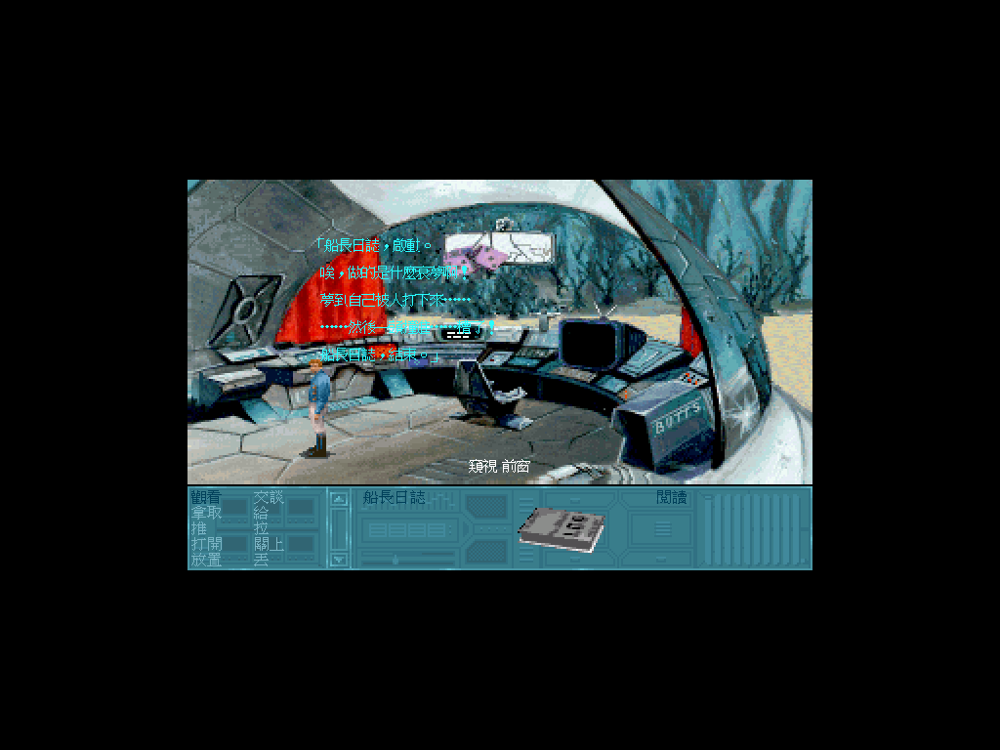
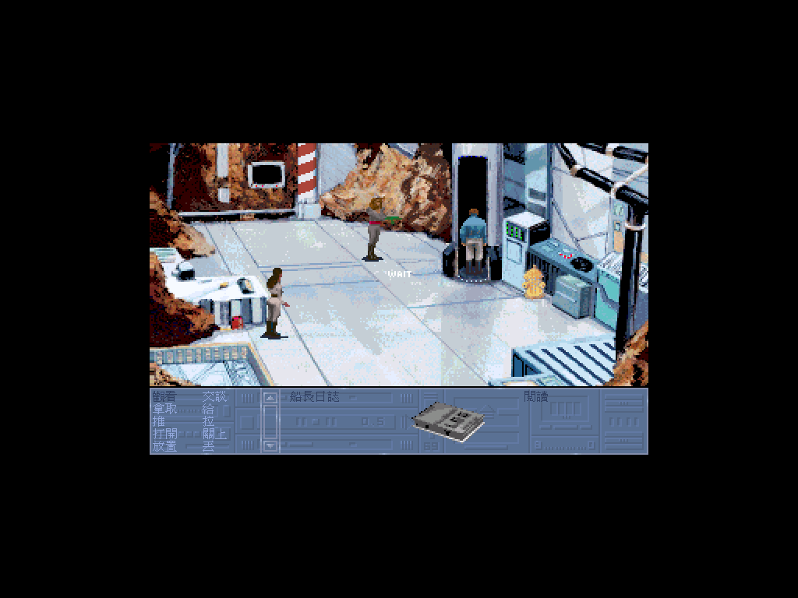
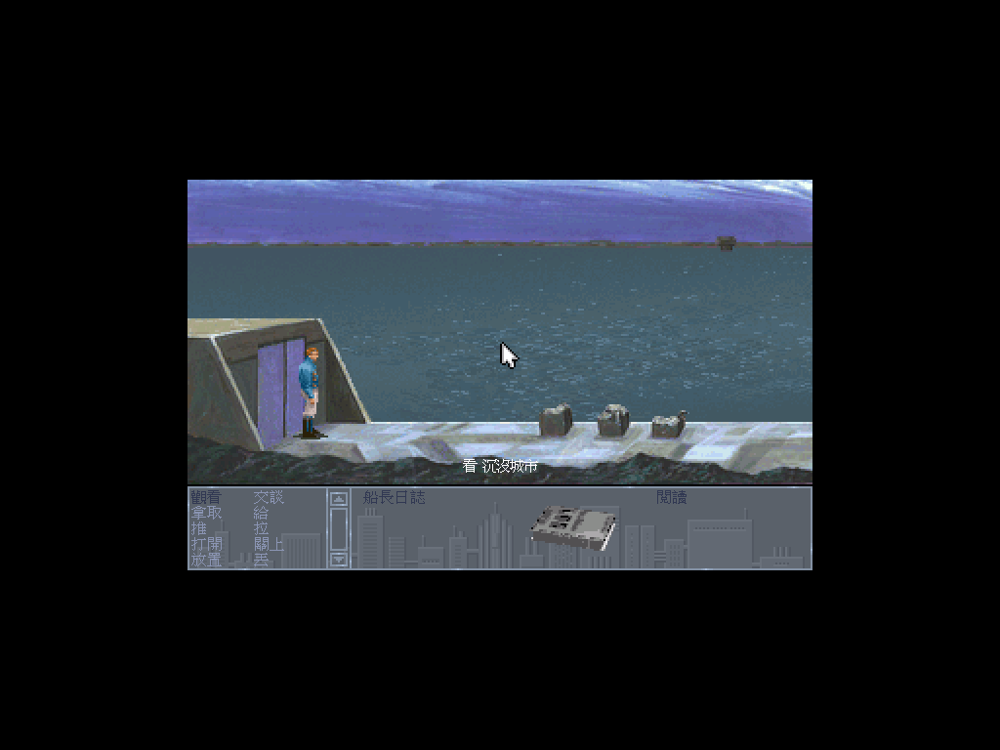
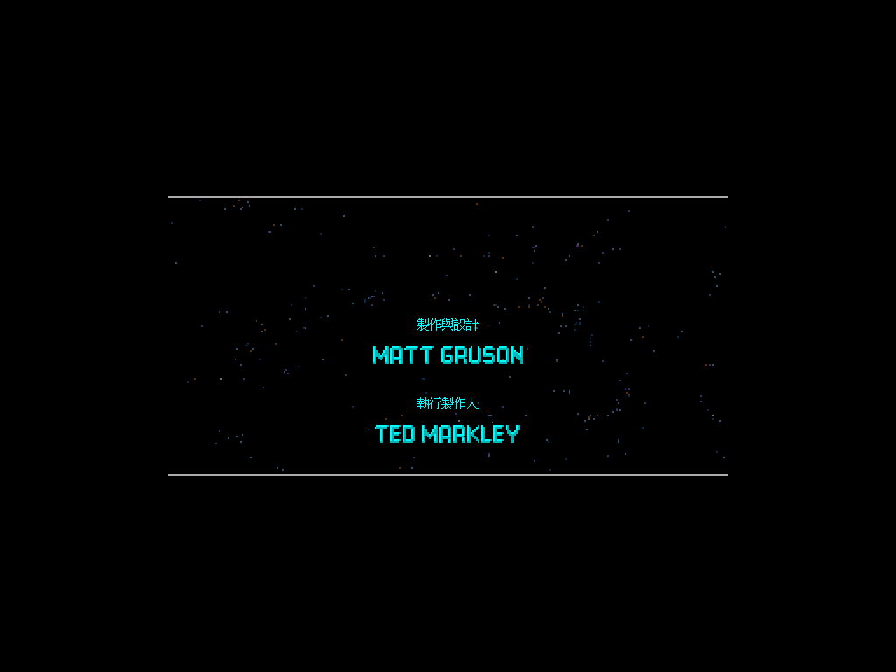

# 錯體奇航 — 一場撿花瓶撿到變性的太空意外　繁體中文化

*Rex Nebular and the Cosmic Gender Bender*

你是雷克斯‧尼布勒，銀河系裡收費最高、運氣最差的太空打撈員。這趟差事聽起來很簡單：某位將軍的花瓶掉在一顆沒人去過的星球上，把它撿回來就有錢拿。你沒問為什麼一只花瓶值這個價，反正你從來不問。

然後防禦砲火把你打了下來。船沉進海裡，你在駕駛艙地板上醒來，滿腦子只想著怎麼離開。你還不知道這顆星球上早就沒有男人了——也還不知道，這裡的居民為了「解決」這個問題，造了一台機器。

把這條路上的每一句話——**4,357 則對白與詞條、2,394 字自製點陣字型、指令表、物品欄、存讀檔介面、片尾製作名單**——全部翻成繁體中文。動詞用單字的年代感、雷克斯的自嘲賤嘴、旁白的冷刀子，都照原作的調性重寫成台灣人會笑的講法，不是逐字直譯。

這裡**只有中文化的部分**：碼表、譯文、自製字型、工具與文件，不含遊戲本體。想直接玩，跳到〈怎麼玩〉。



---

## 這款當年沒有中文版，只有中文說明書

台灣的老遊戲清單裡查不到這款的中文版；但我們手上有一本 20 個版面的中文遊戲手冊，
把操作介面、選項、道具全都譯過一輪。也就是說：**當年有人把說明書翻完了，遊戲本身卻始終是英文的。**

這份中文化把手冊裡的譯名全部接了回去，包括那艘船的名字。

| 英文 | 中文 | 出處 |
|---|---|---|
| Rex Nebular | 雷克斯‧尼布勒 | 手冊 |
| *Slippery Pig* / the Pig | **油豬號** | 手冊（300dpi 複核）＋遊戲文字交叉印證 |
| Log | 船長日誌 | 手冊 |
| Rebreather | 水中呼吸器 | 手冊 |
| Story Line: Naughty / Nice | **限制級 / 輔導級** | 手冊 |
| No Sound | **無聲勝有聲** | 手冊（當年的譯法，原樣保留） |

船名這條走了一段彎路：第一次用 110dpi 判讀成「油鵝號」，後來從遊戲文字裡撈到
`the "Slippery Pig"`，回頭用 300dpi 重掃，才確認手冊寫的是**油豬號**。
一手資料永遠贏推論——這個專案裡不只發生一次。

完整譯名表見 [`docs/20-glossary.md`](docs/20-glossary.md)。

## 技術：MADS 引擎沒有中文路徑，所以得動引擎

這款跑在 ScummVM 的 **MADS** 引擎上（gameid `nebular`），不是 SCUMM。
差別很要命：SCUMM 有現成的 CJK 路徑，挑對碼空間就能零改動；MADS 沒有。

```cpp
// engines/mads/font.cpp  Font::writeString()
char theChar = (*text++) & 0x7F;      // ← 每個位元組被強制遮成 7-bit
```

`_charWidths` 只開 128 格。任何 ≥ 0x80 的位元組——Big5 的 lead byte 必然是——都會被折成一個
ASCII 字元。這一行決定了整個專案的形狀：**非改引擎不可**，剩下的問題只是「怎麼改得夠小」。

改動集中在四個地方，每個都說得出為什麼非改不可：

| 檔案 | 改什麼 | 為什麼 |
|---|---|---|
| `mads/cht.h/.cpp`（新增） | Big5 點陣字庫 + 譯文替換表 | 中文邏輯全部關在這裡 |
| `font.cpp` | 認雙位元組、中文畫進文字層、寬度回報等效值 | 上面那行 `& 0x7F` |
| `screen.cpp` | 2× nearest 放大 + 文字層合成 | 讓中文以原生解析度顯示 |
| `game.cpp` / `scene.cpp` / `menu_views.cpp` / `staticres.cpp` | 五個文字來源的查表 hook | 少接一個就露英文 |

### 中文為什麼要另開一層畫

第一版把 16×15 的中文畫進遊戲的 320×200 緩衝，結果被 `Screen::update()` 連同底圖
一起放大成 **32×30 實際像素**——比放大後的英文（14px）大了一倍有餘。

放大這件事發生在「送畫面」那層，它不分辨像素是底圖還是文字。但**底圖需要放大**
（原生 pixel art），**文字不需要**（點陣字是為某個尺寸手工調的）。綁在同一次放大裡，
必定有一方是錯的。

解法是開一張 640×400 的文字層，中文 1:1 畫上去、不跟著放大，合成時疊在放大後的底圖上；
排版度量則回報「320 空間的等效寬度」。這一步做完之後，**先前為了塞中文而改的 UI 佈局全部撤回了**
——原版的 5 列 8px 指令表重新變得剛好。改對架構，引擎改動反而變少。

### 三個查了很久的坑

**顏色 0 不能當透明。** 文字層用「像素值 0」判斷透明，但 0 是合法的調色盤索引，
而 MADS 的文字色真的會是 0。那些字被畫成 0、合成時判定成透明，於是**一行字裡少了幾個**，
露出底圖，看起來像被黑塊蓋住。解法是另開遮罩。
通則：任何「用特殊值代表沒有資料」的設計，先問這個值是不是也是合法資料。

**`strchr` 會咬到 Big5 的第二個位元組。** 片尾一度顯示成「製宏P設計」（應為「製作與設計」）。
`menu_views.cpp` 用 `strchr(line, '@')` 找置中標記，而 `@` 是 **0x40**——
「作」= `A7 40`、「一」= `A4 40`。掃描在中文字的第二個位元組上誤中，把字從中間切開。
這是 SCUMM/AGI 那邊著名的「許功蓋問題」（撞 `\`=0x5C）的同型。
修法是遇到 lead byte 就整個跳兩格，並回頭盤點引擎裡所有 `strchr`/`strstr`。

**翻譯會靜默改變引擎行為。** `action.cpp` 有一處拿 vocab 字串去**比對**而不是顯示
（`getVocab(...) != kFenceStr`）。把 vocab 翻成中文後，這個比對永遠成立，遊戲邏輯就變了——
不會報錯，也不會崩潰。解法是留一份未翻譯的原文供比對：**顯示用譯文，邏輯用原文**。

技術細節見 [`docs/30-engine-design.md`](docs/30-engine-design.md)。

## 字型：倚天點陣字，不是 TTF 縮出來的

16×15 的字模取自倚天中文系統的原生點陣字——1990s DOS 中文長什麼樣，它就長什麼樣。
TTF 縮到這個尺寸筆劃比例會跑掉、複雜字糊成一團。

字型只烘譯文用到的 **2,394 字**（含全形標點；`STDFONT` 不含標點，漏帶 `SPCFONT` 會讓
`，。！？「」` 全部掉進 fallback，畫面上「字是倚天、標點是別的字型」）。

## 聲音：Sound Blaster 的兩層

包裡預設就是 SB 配置，音樂與音效都開。1992 年講「支援 Sound Blaster」是兩件事：

- **音樂**走 SB 卡上的 **YM3812**——那跟 AdLib 卡是同一顆 FM 晶片，所以「AdLib 音樂」
  和「SB 音樂」在這款是同一件事
- **音效**走 SB 的 DAC，是數位取樣。資料封在 `REX009.DSR` 裡（22 筆，8000 Hz 8-bit PCM），
  不在遊戲根目錄，`ls` 看不到

**MT-32 這款做不到**，而且花了點功夫才確定。ScummVM 的 MADS 引擎根本沒有 MIDI 路徑
（`sound.cpp:45` 建構子直接建 OPL，全引擎 grep `MidiDriver` 零命中），
遊戲附的 `rsound.*` Roland 驅動是 DOS 執行檔不是音樂資料，而手上這份又沒有原版 `.EXE`
可以拿去 DOSBox 跑。

有趣的是**我一開始真的錄到了一份「MT-32」音訊**——416 秒、log 乾淨、音量正常。
抓到它其實是 AdLib 的方法是頻譜比對：兩份錄音的諧波梳狀結構與脈衝間隔完全同型，
根本沒切換過。驗證某個設定有沒有生效，不能看「我設了參數」，也不能只看「log 沒報錯」，
要找一個會因為它而改變的可觀測量，跟對照組比。

細節見 [`docs/50-audio.md`](docs/50-audio.md)。

## 畫面

| | |
|---|---|
|  |  |
| 沉沒的城市 | 岸邊，UI 面板隨場景換皮 |



片尾製作名單也翻了：職稱中文化、人名保留英文。

## 怎麼玩

需要自備遊戲（本專案不含遊戲資料）。

**Windows**：下載 `rexnebular-cht-win64.zip`，解開，把遊戲檔複製進 `game` 資料夾，
雙擊 `PLAY-REX-CHT.bat`。設定只寫在包內的 `scummvm.ini`，不會動到你系統上其他 ScummVM。

**macOS**：下載 `RexNebular-CHT-macos-universal.dmg`（arm64 + Intel 通用），
第一次開啟前先解隔離：`xattr -dr com.apple.quarantine /Applications/ScummVM.app`。

**Linux**：`RexNebular-CHT-x86_64.AppImage`，`chmod +x` 後直接執行。

**已經有自己編的 ScummVM**：套 `patches/rex-cht-engine.patch`（基準 ScummVM v2.8.0），
再把 `cht-data/` 兩個檔放進遊戲目錄或用 `--extrapath` 指過去。

**中文的開關就是那兩個檔在不在**——移走就變回英文原版，不需要任何設定，
也不必改 `--language`（MADS 的 detection table 全是 `EN_ANY`，設非英文語言反而會改變
detector 行為）。

### 包裡帶了什麼、為什麼

Windows 與 macOS 的 ScummVM 都是為這款重編的：只含 MADS 引擎，SDL2 從原始碼自編
（不用預編譯包——macOS 那邊的 `brew sdl2` 從 2026 起是架在 SDL3 上的 shim，
玩家端會黑畫面，而開發機測不出來），外部媒體庫全關（這款是 1992 floppy 版，
音樂走 AdLib、動畫自帶解碼，用不到 vorbis/flac/theora）。

`cht-data/ENGINE.txt` 裡是引擎指紋——`engines/mads/` 底下所有 `.cpp`/`.h` 排序後的
sha256 前 12 碼。三平台由同一份 patch 套出，指紋必須相同。
只比中文資料的 md5 對「只改引擎」是完全的盲區：資料全對、包卻裝著修正前的引擎，
檢查照樣全綠。

## 專案結構

```
docs/                 設計與譯名文件
  00-scope.md         抽字實測數據（各來源則數、控制碼分佈）
  20-glossary.md      統一譯名表（手冊一手 + 兩輪收斂定案）
  30-engine-design.md 引擎改造設計與踩過的坑
workplace/
  tools/              抽字、烘字型、驗收、正規化、截圖、推廣片腳本
  out/batches/        30 批譯文（key + 英文原文 + 譯文）
  scummvm-src/        自編的 ScummVM（含中文化 patch）
  dist-all/           產物：patch zip、AppImage（gitignore）
  out/promo/          推廣片
```

### 工具鏈

| 腳本 | 做什麼 |
|---|---|
| `mads_res.py` | HAG 封裝、MadsPack 容器、FAB 解壓（全部照 ScummVM 原始碼實作） |
| `extract_text.py` | 抽出五個來源的全部文字 |
| `roundtrip.py` | 可逆性證明：重組後與原始 byte 完全相同才准動文字 |
| `build_cht_font.py` | 從倚天字庫烘出譯文用得到的字 |
| `verify_batch.py` | 逐行檢查 key／原文未被改動、控制碼數量一致、可 cp950 編碼 |
| `normalize_batch.py` | 半形標點轉全形（**跳過控制碼內部**）、譯名收斂 |
| `shot.sh` / `shot_scenes.sh` | headless 截圖；後者用 `--boot-param` 逐場景驗收 |
| `record_audio.sh` / `make_promo.sh` | 錄原版配樂、合成推廣片 |

每支檢查工具都做過**正對照**——餵一個必定違反的輸入，確認它真的會叫。
沒有紅字有兩種可能：東西是好的，或檢查自己壞了。

## 授權與範圍

- 本專案只包含：譯文、碼表、自製點陣字型、工具腳本、文件、以及對 ScummVM 的修改（GPLv3）。
- **不包含**遊戲資料、原版音樂、手冊掃描——那些是 MicroProse 的著作權。
- 遊戲原作 © 1992 MicroProse Software, Inc.
